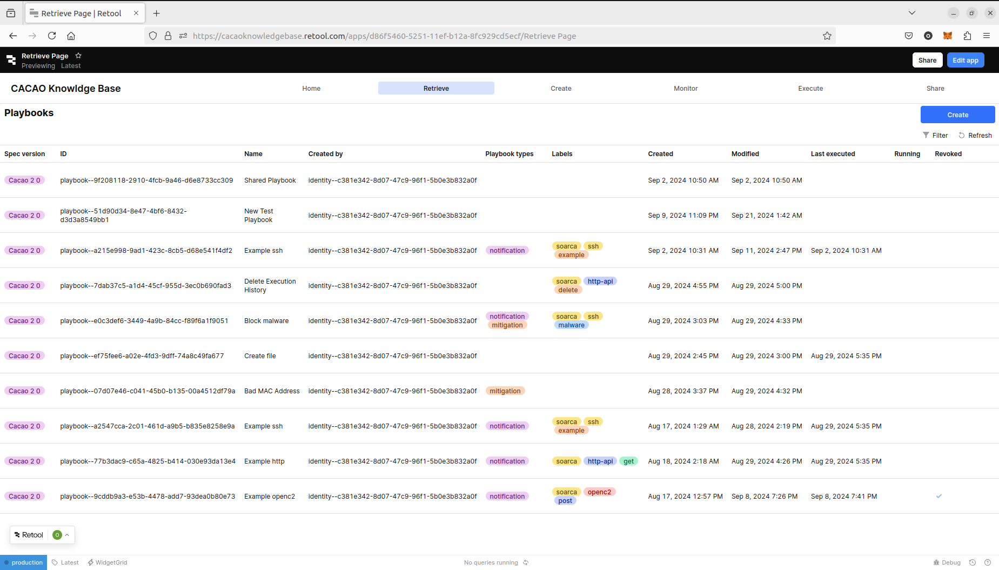
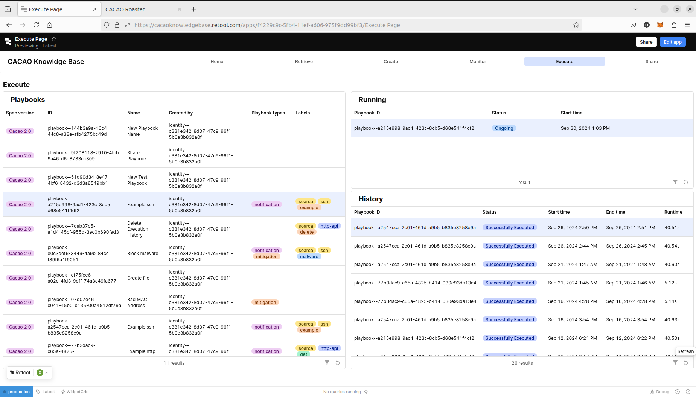

# **CACAO Knowledge Management System**  

## **Overview**  
This repository contains an implementation of a **CACAO Knowledge Management System**, which enables easy storage, retrieval, and management of CACAO v2.0 playbooks throughout their lifecycle.

The CACAO Standard is an open standard designed to structure and automate cybersecurity playbooks. It provides a standardized format for defining, sharing, and executing security procedures, helping organizations improve incident response. For wider adoption of the CACAO specification, we provide a dedicated Knowledge Management System to simplify the management, execution, and sharing of CACAO playbooks.

The CACAO Knowledge Management System complies fully to the [**CACAO v2.0 specification**](https://docs.oasis-open.org/cacao/security-playbooks/v2.0/security-playbooks-v2.0.pdf).

⚠ **Note:** This project was developed for **research purposes only** and is **not intended for production use**.

## **Features**  
- **Backend:** The backend is built using **FastAPI**, a modern web framework for building APIs with Python. It provides high performance and automatic OpenAPI documentation, making it efficient for managing CACAO playbooks
- **Frontend:** The frontend is developed using **Retool**, a low-code platform that enables rapid UI development. It provides a user-friendly interface for interacting with the system
- **Submodules:**
  - **SOARCA v1.0.0** – A SOAR tool, used for the execution of CACAO playbooks and execution status reporting 
  - **CACAO Roaster** – A web application for generating, parsing and validating, manipulating, and visualizing CACAO playbooks
  - **CTI TAXII Server** – A minimal implementation of a TAXII 2.1 Server, used for sharing CACAO playbooks

## **Demonstration**
### **Screenshots**
Retrieve Page


Execute Page


### **Demo**
Watch a demonstration of the **CACAO Knowledge Management System** in action:  

▶ [**Watch on YouTube**](https://youtu.be/6fGhg02aMlg)

## **Installation & Usage**  
To get started, clone the repository with submodules:  

```sh
git clone --recurse-submodules git@github.com:Orestistsira/cacao-knowledge-base.git
cd cacao-knowledge-base
```

This project can be set up **locally** using **Docker Compose** for easy deployment.  

### **Prerequisites**  
- Install [Docker & Docker Compose](https://docs.docker.com/engine/install/)

### **Build & Run the Project**  
To start all services in detached mode:  
```sh
docker-compose up -d
```

### **Stopping the Services**  
To stop all services:  
```sh
docker-compose down
```

### **Viewing Logs**  
For logs of all services: 
```sh
docker-compose logs -f
```

### **Backend API Access**  
Once the backend is running, it will be available at: [http://localhost:8000](http://localhost:8000)

You can explore the Swagger API documentation at: [http://localhost:8000/docs](http://localhost:8000/docs)

This interactive interface allows you to test API endpoints and understand how the backend functions.

### **CACAO Roaster Editor**
The CACAO Roaster will run locally on: [http://localhost:3000](http://localhost:3000)

### **Frontend**

The frontend of this project is built using **Retool**. To use it, you must have a **Retool account** and follow the steps below to import and configure the application.  

#### **1. Create a Retool Account**  
1. If you don’t have one, sign up at [Retool](https://retool.com/).  
2. You can use either **Retool Cloud** (hosted) or a **self-hosted** instance.

#### **2. Import the Retool Apps**  
1. In your Retool dashboard, go to **Apps → Create → From JSON**.  
2. Upload the **6 JSON files** from the `frontend` folder in this repository.  
3. This will create the required apps for managing CACAO playbooks.

#### **3. Create a REST API Resource**  
The frontend interacts with the backend via a **REST API Resource**. To configure it:  
1. Go to **Resources → Create New → Resource**.
2. Select **REST API** as a resource type.
3. Set the **Base URL** to: [http://backend_service:8000](http://backend_service:8000)
4. Create the resource.

#### **4. Using Retool Cloud? Set Up Ngrok (Recommended)**  
If using Retool online and running the backend locally, you need to expose the API. We recommend using **Ngrok**:  
1. Install [Ngrok](https://ngrok.com).  
2. Run:  
```sh
ngrok http http://localhost:8080
```
3. Copy the generated public URL and update the **Base URL** in your Retool **REST API Resource**.

## **Maintenance & Contributions**  
This code is provided **as is** for the academic and cybersecurity community, with the aim of encouraging adoption, supporting the broader uptake of CACAO playbooks, and promoting the widespread use of interoperable automation and orchestration mechanisms in cybersecurity operations.

We do not guarantee the correctness, reliability, or security of this code and make no commitments to maintaining it, addressing bugs, or providing support. Contributions are welcome; however, we do not promise to review or merge pull requests in a timely manner. Users are encouraged to fork and modify the code as needed for their own purposes.

## **License**  
This project is licensed under the **Apache License 2.0**—see the [LICENSE](LICENSE) file for full details.

Under this license, you are free to use, modify, and distribute this code, provided that you comply with the terms, including proper attribution and including the original license notice in derivative works.

In addition, if you use this code in academic or research work, we kindly request that you acknowledge the original research by citing the following publication:

- **[Full citation of the paper, including authors, title, journal/conference, year, and DOI/link]**

While citation is not a strict legal requirement under the license, properly referencing this work helps support continued research and development in this area.

## **Acknowledgments**  
This work was conducted as part of a postgraduate thesis at the School of Electrical and Computer Engineering, Aristotle University of Thessaloniki, under the supervision of Prof. Ioannis Papaefstathiou.

Additionally, this research was supported by **[Automaton Technologies Ltd](https://www.automaton-technologies.eu/)**, whose insights, contributions and collaboration are gratefully acknowledged.

This project also builds upon existing open-source efforts, including:  

- **[SOARCA](https://github.com/COSSAS/SOARCA)**  
- **[CACAO Roaster](https://github.com/opencybersecurityalliance/cacao-roaster)**  
- **[CTI TAXII Server](https://github.com/oasis-open/cti-taxii-server)**  

